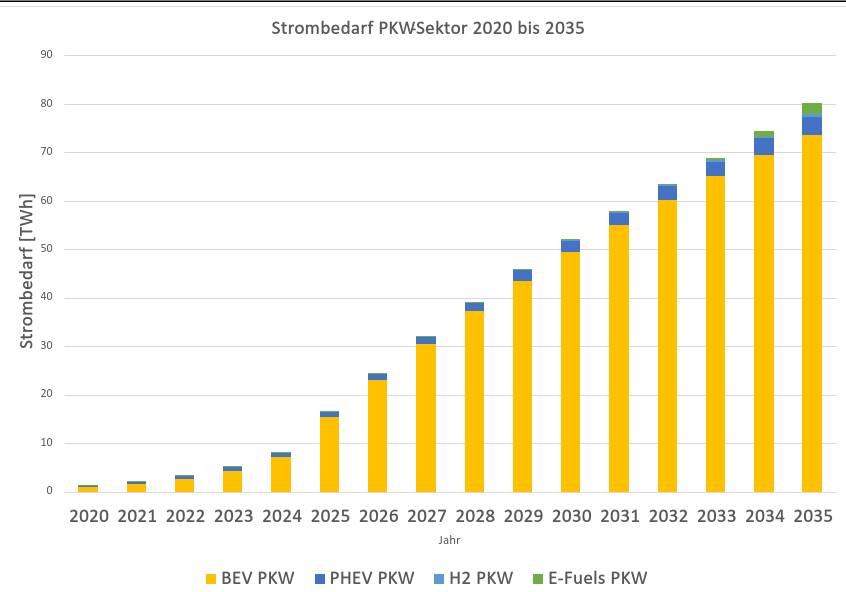

# Modellannahmen
## mit Unterkategorien
### und Unter-Unterkategorien

Ähnlich wie ein [Personenkraftwagen](CRF1A3bPWK.md)
**,bin ich fett** _schief_ [und verbinde A und B](https://app.element.io/germanzero.de).

Man muss aufpassen
das nicht alles ein Absatz ist,
was so aussieht.

# Szenario

Hier würden wir dann die Bilder einbetten aber das passiert erst, wenn wir alle Modelle fertig haben und uns sicher sind,
was wir für Annahmen treffen wollen.

